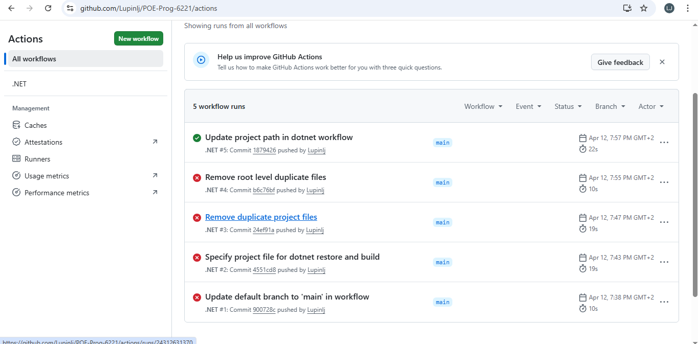

# Cybersecurity Awareness Chatbot

## Description
This is a console-based chatbot that teaches users on cybersecurity topics such as password safety, phising, safe browsing, and two-factor authentication.

## How to Run
1. Clone the repository
2. Open the solution in Visual Studio
3. Press F5 or click Run
4. The chatbot will play a welcome sound and launch in the console

## Requirements
- .Net 8.0
- Windows

## CI Workflow

